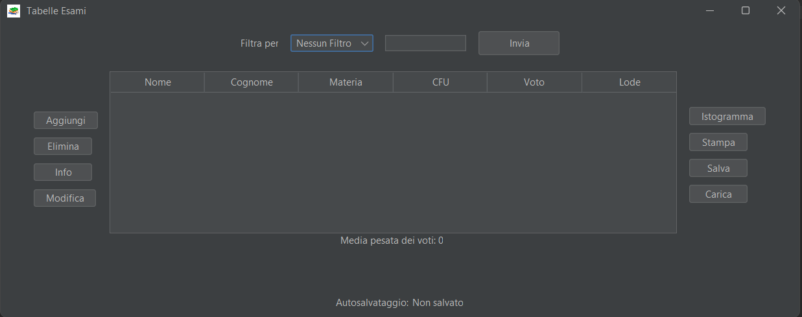

# 🎓 Gestione Esami
Progetto d’esame per l’insegnamento di Programmazione a Oggetti 2023/2024

## 📝 Regole per lo svolgimento
Il progetto deve essere svolto usando il linguaggio Java e possedere i seguenti requisiti implementativi:
 - ✅ Essere dotato di **interfaccia grafica** tramite cui interagire con il programma stesso.
 - ✅ Sfruttare i meccanismi di **incapsulamento, ereditarietà e polimorfismo**.
 - ✅ Per l’ereditarietà è possibile sfruttare **classi astratte e interfacce**; si considerano **escluse** le relazioni di ereditarietà diretta da classi di libreria Java.
 - ✅ Sfruttare le classi di sistema Java per la gestione dell'**input/output**.
 - ✅ Utilizzare le **strutture dati** di libreria e i **generics**, motivando le scelte fatte.
 - ✅ Dividere in modo coerente le classi in **package**.
 - ✅ Il programma deve essere eseguibile da **linea di comando**.

🌐 Il software deve essere accompagnato da pagine di **documentazione HTML** (ad esempio le pagine generate tramite Javadoc o altri strumenti come Doxygen) che descrivano le scelte di progetto effettuate e la struttura del sistema software. 🌐

Nel seguito del testo, i paragrafi evidenziati in azzurro sono **facoltativi**, e servono per differenziare il voto.

Lo svolgimento della parte **obbligatoria** contribuisce al voto per **25 punti**. Il contributo delle parti facoltative (✨) è riportato nelle rispettive descrizioni. Si noti che il **punteggio massimo** rimane comunque **30/30**.

## 🔍 Descrizione del progetto
Questo progetto mira all’implementazione di uno strumento per la gestione statistica degli esami universitari. In particolare, ci si pone lo scopo di fornire ad un ipotetico docente un modo rapido ed intuitivo per raccogliere e gestire esami universitari di diverso tipo tenendo quindi sotto controllo le carriere accademiche degli studenti.

Il presente progetto si propone di descrivere e sviluppare una applicazione Java che abbia le seguenti funzionalità (dettagliate nei paragrafi successivi):
 - Gestione degli esami;
 - Salvataggio e caricamento degli esami inseriti;
 - Visualizzazione dati statistici
 - Stampa della tabella degli esami.

---

### 📊 Gestione degli esami
La gestione degli esami prevede la visualizzazione in forma tabellare delle prove d’esame sostenute dagli studenti. In particolare, ciascuna entry nella tabella deve avere le seguenti informazioni:
 - 📍 Nome e Cognome dello studente
 - 📍 Nome dell’insegnamento
 - 📍 Voto finale (nel range [18 -30])
 - 📍 Lode (Sì/No)
 - 📍 Numero crediti

Ogni voce rappresenta quindi una prova d’esame di uno studente.

L’utente deve avere la possibilità di aggiungere, modificare e cancellare le voci della tabella.

Quando l’utente aggiunge l’esito di un esame all’interno della tabella, l’applicazione deve proporre la scelta tra due diverse tipologie di esame. Semplice o Composto.

Un esame si dice semplice se il suo voto finale è determinato da un’unica prova. Diversamente un esame è composto se il voto finale è determinato dall’esito di almeno due prove intermedie. Più nel dettaglio, il voto finale di un esame composto è la media pesata dei voti inseriti per le prove intermedie che lo compongono. Quindi, in caso di scelta di inserimento di un esame composto, l’utente anziché inserire direttamente il voto finale, deve specificare di quante prove è composto ed il peso di ciascuna. Il peso deve essere visto come una percentuale e le prove intermedie non prevedono lodi.

> **Per implementare questa caratteristica e le funzionalità collegate si suggerisce di utilizzare il polimorfismo in Java.**

Se l’utente clicca su una riga della tabella che contiene una prova d’esame composta, l’applicazione deve poter mostrare l’esito e i pesi delle prove intermedie.

Tramite un meccanismo di filtro sulla tabella, l’utente può decidere se visualizzare tutte le informazioni inserite (nessun filtro), oppure filtrare per studente o per singolo insegnamento. Per queste operazioni, si può anche utilizzare un campo di testo editabile la cui stringa inserita viene comparata alle entry della tabella. 

A seconda del filtro scelto, il form contenente la tabella deve mostrare all’utente la media pesata dei voti finali sostenuti nelle prove d’esame. Si trascuri l’effetto delle lodi.

Si predispongano appropriati controlli per garantire la correttezza dei dati inseriti. 

✨ **{Facoltativo 2 punti}**: opzionalmente, si cerchi di implementare l’opportuna strategia in grado di evitare situazioni in cui “Programmazione **ad** Oggetti” e “Programmazione **Ad** Oggetti” siano viste dal sistema come due insegnamenti separati.

---

### 💾 Salvataggio e caricamento degli esami inseriti
L’utente deve avere la possibilità di **salvare** la tabella su un file, specificandone il **nome**, e di **ricaricare** il file specificando il nome del file salvato in precedenza.

✨ **{Facoltativo 2 punti}**: nel caso in cui si tenti di salvare l’elenco degli esami in un file che esiste già, deve essere chiesto all’utente se desidera **sovrascrivere** il file esistente

✨ **{Facoltativo 5 punti}**: si implementi un meccanismo di **salvataggio automatico** basato su un thread che periodicamente salva le informazioni in un file temporaneo.

✨ **{Facoltativo 5 punti}**: il sistema deve tenere traccia del fatto che l’ultima modifica sulla tabella da parte dell’utente sia stata salvata o meno. In questo modo, intercettando l’evento di chiusura del frame principale il sistema può avvertire l’utente che vi sono modifiche non salvate e di conseguenza chiedere se operare o meno il salvataggio su disco

---

### 📈 Visualizzazione dati statistici
L’utente deve avere la possibilità di visualizzare in un grafico le statistiche inerenti alle prove sostenute. Più nel dettaglio, una volta che l’utente ha scelto di filtrare per studente o per insegnamento, l’interfaccia grafica deve mostrare un pulsante che se premuto visualizza un istogramma di frequenze relativo ai voti.

---

### 🖨️ Stampa della tabella degli esami
✨ **{Facoltativo 1 punto}**: punto: Si dia all’utente la possibilità di **stampare** la tabella. Si sfruttino le classi di libreria Java per stampare tramite una delle stampanti configurate dal sistema operativo.

---

## 📚 Materiale utile
 - 🖨️ Metodi *print()* di *JTable*. Interfaccia Java *java.awt.print.Printable* e classe Java *java.awt.print.PrinterJob* per stampare su stampante. Si consulti la documentazione e si possono trovare tutorial online.
 - 📊 Suggerimenti di librerie esterne per la generazione di grafici: [https://www.jfree.org/jfreechart/](https://www.jfree.org/jfreechart/) [https://knowm.org/open-source/xchart/](https://knowm.org/open-source/xchart/); anche in questo caso, si consulti la loro documentazione o i tutorial disponibili online.

---
## Risultato finale

---
Spero che questa mia soluzione possa esserti utile e rappresenti un'ottima base per approfondire le tue competenze di programmazione in Java. Buon lavoro e ... Buon Coding! 🚀
